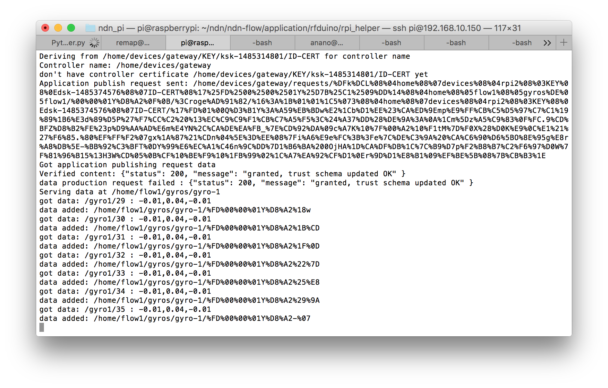

Starting the Flow application installed at Huawei
=================================

### RaspberryPi Gateway (192.168.100.140)
(This is optional since all devices are already added to the network)

**If you need to run the controller:**

* Access the gateway using ssh
```
ssh pi@192.168.100.140
```
Password is the default one: "raspberry".

* Start NFD if it's not already running
```
nfd-start
```

* In a different terminal window from the one running NFD, do
```
cd ~/ndn/ndn-flow/framework/
export PYTHONPATH=$PYTHONPATH:$(pwd)
cd ndn_pi
python iot_controller.py
```

**What to expect on gateway:**
 * Controller runs and brings up a menu with options to add devices as shown in the following screenshot


### RFduinos

Switch to "On" for the switches on battery shields

**What to expect on RFduinos:**
 * MPU6050 gyroscope's, and battery shield's lights light up
 * If USB debugging, RFduino will first print encrypted HMAC key to serial port, then once helper is connected, it keeps printing gyro readings

### RaspberryPi Helper (192.168.100.141)
**To start RaspberryPi helper:**

* Access the gateway using ssh
```
ssh pi@192.168.100.140
```
Password is the default one: "raspberry".
* Start NFD if it's not already running.
```
nfd-start
```
* In a different terminal window from the one running NFD, do
```
cd ~/ndn/ndn-flow/application/rfduino/rpi_helper/
```
* Either run
```
python rpi_helper.py --addr e1:16:f4:d2:f6:0f,cd:87:e7:83:90:85 --namespace /home/flow1/gyros/gyro-1,/home/flow1/gyros/gyro-2
```
Or look at the last few executed commands using 
```
history | grep python
```
And it should contain the same command as above.

**What to expect in Raspberry Pi console:**
 * rpi_helper asks for permission from controller
 * In this example, no matter if the permission times out (after 3 tries) or is granted, the Pi will try to connect to the gyroscopes and publish their data afterwards. Console will print "data added: data name", and gyro readings as shown in the following screenshot



### Ubuntu Opt publisher (192.168.100.101)

**To start OpenPTrack and NDN-opt publisher:**

1. Refer to the TechGuide "opt" section for running OpenPTrack
2. Refer to [ndn-opt readme](https://github.com/OpenPTrack/ndn-opt/tree/master/publisher#how-to-use) for running the NDN publisher

**What to expect in OpenPTrack box console:**
 * ndn-opt prints messages of track data added

### Unity Laptop (192.168.100.130)

**To run Unity visualization component:**

1. Start NFD if it's not already running.
```
nfd-start
```
2. Register routes to other components if not already registered.
```
cd ~/Desktop
./nfdcs.sh
```
3. Run Unity, click "Run" button

**What to expect in Unity:**
 * If Unity gets data from OpenPTrack, in "Scene" view, green and red numbers will appear on the scene, representing the track ID of a person tracked in the space. Each number will keep building small mountain spikes around it
 * If Unity gets data from gyroscope, in "Game" view, tilting the Orientation gyro (labeled 1) will change the torque of the blimp camera. And tilting the Thrust gyro (labeled 2) will change the thrust of the blimp camera depending on the pitch value reading
 * If Phone connects to Unity successfully, hitting a link on the phone will cause an image to be dropped from the location of the blimp camera


### Android phone (on DHCP, 192.168.100.150 - 200)

1. Launch Firefox browser on the phone
2. Load http://192.168.100.101/application/website/index.html
3. Point the Face URL to Unity laptop (192.168.100.130), phone's identity to "/home/devices/honor5x", Unity laptop's identity to "/home/devices/macbook1", and click "Connect Face"
4. On the next page, click "Associate me with a track"
5. On the last page, click any images you want to draw after Unity's running

**What to expect on Android phone:**
Phone shows a list of image links that can be dropped onto Unity visualization.


### Tree visualization laptop

1. Launch Chrome or Firefox browser on your laptop
2. Load http://192.168.100.101/application/website/names.html
3. Point the Face URL to Unity laptop (192.168.10.130), and click "Connect Face"

### Troubleshooting the system

**Unity doesn't get data from one of the subsystems?**

After making sure the specific subsystem (e.g., gyroscopes) runs properly, check NDN routes on Unity as well as the specific system (e.g., RaspberryPi helper). You can do 
```
nfd-status
```
to check existing faces on both. Unity laptop should have an entry pointing to the subsystem (e.g. Face entries should contain tcp/udp://192.168.100.141, FIB entries should contain "/home/flow1/gyros" pointing to that FaceID). If a route is missing, you can do
```
nfdc register [prefix] [faceURI]
```
If Unity still doesn't get data at this point, you can try
```
ndnpeek -pf [prefix]
```
on Unity laptop, to see if console can get data. If so, please double check the name configurations in Unity is correct (e.g., gyro data suffix has "gyro-1", instead of "gyro1" configured).

**A piece of the software complains about "default identity not configured, please configure the device with this identity first"?**

Please run the add\_device script for the device that the software is running on, and add the device using the expected name on the home gateway (iot\_controller.py). Refer to [this section](https://github.com/remap/ndn-flow/tree/master/framework/ndn_pi#how-to-use) for more details.

**A piece of the software complains about "default certificate / key for identity not set"?**

Please update the code to latest, and run add\_device scripts again (similar with previous question).
